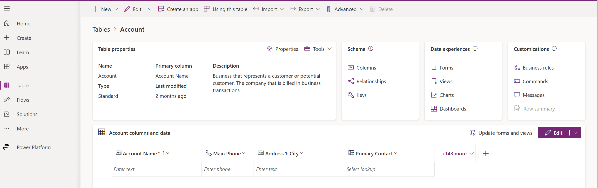

**Ground the agent responses in enterprise data**

In this exercise the agent will be configured to ground the executive summary report with the information available in company´s CRM system. The report will include information about the revenue, that is stored in the Account table in the Dataverse (CRM System).

In the next steps the account information will be populated into the Accounts table

1. Open Microsoft Edge and browse to https://github.com/microsoft/TechConnect2025-Lab210/blob/main/skillable/accounts.csv to download the cvs file that countains information regarding the account revenue

2.Click the **...** on the top

3. Click **Download**

3. Click **Save as**

4. Click **Save** to save the file in the Downloads folder

5. On Microsoft Edge browse to https://make.powerapps.com/environments/default-4cfe372a-37a4-44f8-91b2-5faf34253c62/entities/70816501-edb9-4740-a16c-6a5efbc05d84

6. Click  **Import** on the top

6. Click  **Browse** 

7. Click on the accounts.csv file that was dowloaded before in the Downloads folder

8. Click **Open**

9. Click **Sign in**

TO-DO screen

10. Click **Next**

TO-DO screen

11. Click **Next**

TO-DO screen

13. Click **Load to existing table** and select "Account" on the **Destination table** dropdown list, finaly click **Next**

14. Click **Publish** to start the import process, this can take a couple of minutes

TO-DO screen

The account information has now been populated in the account table , let´s now start the Copilot Studio required configurations

1. Case you have closed the Copilot Studio tab do the following steps otherwise skip to step 5

2. Open Microsoft Edge and navigate to <https://copilotstudio.microsoft.com>

3. Select **Library** on the left menu

4. Find your agent name in the list displayed and click on it

5. edit your agent instructions by adding the following statement "- Primary Contact, must be retrieved from internal data sources without any citation, writing only the name" after "- Dividend per share history for the last five years in a table with columns for dividend and year." 

6. Click **Add action**, the connector list is displayed

<add screenshot>

6.  Search for **list rows**, scroll down until **List rows from selected environment** is displayed and click on it (highlight search box)

7. Click **Next** to create a Dataverse connection

8. Provide the value "List existing accounts with account revenue" in the fields:
- Name
- Description for the agent to know when to use this action
- Usage Description

9. Expand **Inputs and outputs** and scroll down

10. Click **Environment**

11. Select **Set as value** in the drop down list

12. Type the url provided in the **Value** textbox and click **Done**

13. Click **Table name**

14. Select **Set as value** in the drop down list

15. Type "accounts" in the **Value** textbox and click **Done**

16. Click **Add Action**

17. Click **Save**

18. Refresh the declarative agent [step 14 in exercide 1] 

The agent is now configured to include information about the revenue, that is stored in the Account table in the Dataverse (CRM System) 

19. Select "Provide an executive summary report for Microsoft" from the Starter prompts and verify the a new section revenue is returned

20. Publish the bot like it has been done [step 22-26 in exercise 1] , clik **Update** on the last step
 
 

